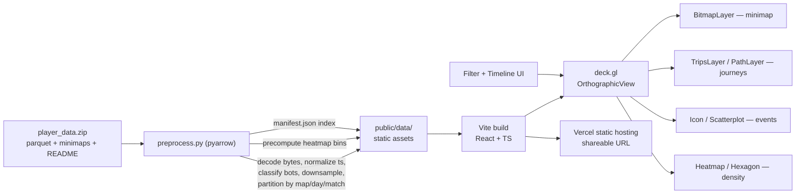

# LILA Games — Player Journey Visualization Tool
## Implementation Plan (v1) — React + Vite + deck.gl

> **What this is.** A senior-engineer's build plan for the LILA "Product Engineer" take-home: a hosted, web-based tool that turns raw LILA BLACK telemetry (parquet) into an interactive map a *Level Designer* can actually use. This document is written to be dropped into the repo as `PLAN.md`.
>
> **Honest caveat, read first.** I have not yet seen `player_data.zip` or its `README`. The `README` is authoritative for the schema, the coordinate system, the bot flag, the bytes encoding, and timestamp units — the exact things being graded under *attention to detail*. Everything below marked **[CONFIRM]** is a reasoned assumption to validate in the first 30 minutes (see §3). The architecture does **not** change based on those answers; only field names and a few constants do.

---

## 0. How to read this

The plan is ordered the way I'd actually execute it: understand the problem, de-risk the data, lock the architecture, solve the one genuinely hard thing (coordinate mapping), then build feature-by-feature, then write the docs that get graded. If you're short on time, the load-bearing sections are **§3 (assumptions to confirm), §7 (coordinate mapping), §6 (data pipeline), and §15 (5-day plan)**.

---

## 1. Problem framing & the one hard thing

LILA BLACK is an extraction shooter. The Level Design team has raw telemetry but "no easy way to see what's happening visually." We are building the *seeing* — a browser tool that answers questions a level designer asks every day:

- Where do players actually go, and where does the map get ignored (dead space)?
- Where do fights break out and where do people die (to other players vs to the storm)?
- Where is loot picked up, and does that pull traffic the way we intended?
- How does a single match unfold over time — rotations, chokepoints, the storm's pressure?

**The single hard technical problem is coordinate mapping**: correctly projecting 3D world telemetry onto a 2D minimap image, per map, with the right axis orientation and no drift. The assignment calls this out explicitly ("this is the tricky part, so walk us through your approach") and grades it under *attention to detail*. Everything else is standard viz engineering; **this** is where the test is won or lost. It gets a dedicated section (§7) and its own verification method (§17).

The second-order challenge is **product judgment**: the user is a Level Designer, not a data scientist. The tool must feel like a design instrument (fast, visual, spatial), not a BI dashboard.

---

## 2. Success criteria — mapped to LILA's rubric

I'm building backwards from the six things they said they'll grade. Every design decision below traces to one of these.

| LILA evaluation area | How this plan targets it |
|---|---|
| **System design** | Clear offline-preprocess → static-assets → deck.gl-render pipeline (§5–6). No accidental complexity; no backend unless data size forces it. Documented trade-offs. |
| **Attention to detail** | Coordinate transform derived + *visually verified* against landmarks (§7, §17). Explicit handling of bytes decoding, bot flag, timestamp units, storm-vs-PvP death split (§4). |
| **End-to-end execution** | Hosted on Vercel, opens with no setup, seeded to a good default view so a grader sees value in 5 seconds (§13, §10). |
| **Product thinking** | UX designed for a Level Designer's questions, not a data table. Sensible defaults, the *right* things filterable, insights that imply map changes (§10, §14 INSIGHTS). |
| **Code quality** | Typed (TypeScript), layered folders, pure transform functions unit-tested, config-driven map registry (§12). |
| **Communication** | One-page `ARCHITECTURE.md` with a data-flow diagram and a trade-off table; `INSIGHTS.md` with evidence-backed, actionable findings (§14). |

**Definition of done (my bar, stricter than the checklist):** a grader opens the link, immediately sees a real match on the correct map with paths aligned to visible geometry, toggles a kill heatmap, scrubs the timeline to watch a rotation, filters to one map/day, and can tell a bot from a human at a glance — all without reading instructions.

---

## 3. Assumptions to confirm against the README (first 30 minutes)

Before writing any feature code, I unzip the data and answer these. This is a checklist, not prose, because it's an operational gate.

**Data shape & files**
- [ ] Is telemetry one table or several (e.g., a high-frequency `positions`/`ticks` table + a discrete `events` table)? **[CONFIRM]** — plan assumes both.
- [ ] Parquet partitioning: one file per map? per day? per match? A single big file? Row counts and total size on disk (drives the pipeline choice in §6).
- [ ] Exact column names and dtypes (`pyarrow` schema dump — see §3.1).

**The four graded gotchas**
- [ ] **Coordinates:** which columns are position (`x,y,z`? `pos_x/pos_y`?), what are the units (cm? m? engine units?), and **how does the README say to map world→minimap** — a bounding box per map, an explicit scale+offset, or anchor points? Which world axes correspond to the minimap's horizontal/vertical, and is there a flip? (§7)
- [ ] **Bytes encoding:** which columns come back as `bytes`/binary (likely `player_id`/`match_id` as UUID-bytes, possibly a packed position blob)? How does the README say to decode them — UTF-8, hex, UUID, or struct-unpack? (§4.2)
- [ ] **Bot detection:** is there an explicit boolean (`is_bot`, `is_ai`, `player_type`), or is it inferred (null account id, id range, name pattern)? (§4.3)
- [ ] **Timestamps:** units (s / ms / µs / ns), epoch vs match-relative, timezone. Is there a per-match start I can subtract to get a clean match clock? (§4.4)

**Semantics**
- [ ] Event taxonomy: exact values for kills, deaths, loot, **storm deaths** (is storm death a separate `event_type`, or a `death` with a `cause`/`source == storm` field?). Extraction events too? **[CONFIRM]**
- [ ] Map registry: the 3 map ids and which minimap image + world-bounds go with each. Minimap image resolutions.
- [ ] Are positions sampled at a fixed tick rate? What rate (drives downsampling in §6)?

**§3.1 — the literal first command I'll run:**

```python
import pyarrow.parquet as pq, glob, json
for f in glob.glob("player_data/**/*.parquet", recursive=True):
    t = pq.read_table(f)
    print(f, t.num_rows)
    print(t.schema)                 # names + dtypes, exposes binary columns
    print(t.slice(0, 3).to_pydict())  # eyeball real values, incl. b'...' bytes
```

If any assumption above is wrong, I fix a constant in the map registry or a decode function in the loader — not the architecture.

---

## 4. Data model & the four gotchas

### 4.1 Working data model (assumed, to confirm)

Two logical entities, normalized after preprocessing:

**Position sample** — the breadcrumb trail:
`match_id, map_id, player_id, is_bot, t_ms (match-relative), x, y (world), [z]`

**Event** — discrete moments:
`match_id, map_id, player_id, is_bot, t_ms, event_type ∈ {kill, death, loot, storm_death}, x, y, [killer_id, victim_id, weapon, item, …]`

Paths, playback, and the traffic heatmap are built from position samples; markers and the kill/death heatmaps from events.

### 4.2 Bytes encoding

Parquet from a game backend routinely stores ids and blobs as binary. `pyarrow` surfaces these as Python `bytes` (`b'\x12\x34…'`), which silently break joins and rendering if treated as strings. Plan:

- Detect binary columns from the schema; decide per column: UUID (`uuid.UUID(bytes=...)`), hex (`.hex()`), UTF-8 (`.decode()`), or **struct-unpack** if positions are a packed blob (e.g., three little-endian float32 → `struct.unpack('<3f', b)`).
- Do this **once, in preprocessing**, and emit clean JSON/Arrow so the frontend never touches raw bytes.
- Document the exact decoding in `ARCHITECTURE.md` — it's a visible "attention to detail" win.

### 4.3 Bot detection

Extraction shooters backfill lobbies with AI. Visual human-vs-bot distinction is a core requirement, so the flag must be right.

- Prefer the explicit README field. If it's a boolean, trust it; if it's a `player_type` enum, map it.
- If it's *inferred*, pick one deterministic heuristic (e.g., synthetic id namespace / null account), implement it as a single pure function `classifyActor(row) → 'human' | 'bot'`, and **document the heuristic and my confidence** in `ARCHITECTURE.md` as an assumption. Never scatter the rule across the codebase.

### 4.4 Timestamps

- Normalize every timestamp to integer **milliseconds** at ingest.
- Compute `match_start = min(t)` per match and store `t_ms = t - match_start` so playback starts at 0 and matches are comparable. Keep absolute time only for the date filter.
- Confirm units by sanity-checking match duration (an extraction-shooter round is typically a few to ~20 minutes; if "durations" come out as hours or milliseconds, the unit assumption is wrong).

---

## 5. System architecture

**Shape:** an offline preprocessing step bakes the raw parquet into compact, partitioned, browser-ready assets; a static React/deck.gl SPA lazy-loads exactly what the current filter needs and renders it on WebGL. **No backend server** in the default design — it's unnecessary, and "static site + CDN" is the most robust way to hit "hosted, opens without your help." (A backend is only introduced if data size defeats static hosting — see §11 escape hatch.)



**Why this stack (rationale for the ARCHITECTURE doc):**

- **deck.gl** is purpose-built for exactly this: GPU-accelerated PathLayer/TripsLayer/HeatmapLayer over a non-geographic 2D image via `OrthographicView`. It scales to hundreds of thousands of points, gives us animated playback (`TripsLayer.currentTime`) and heatmaps essentially for free, and keeps the "align data to an image" problem to a single well-understood primitive (`BitmapLayer` bounds). Building the same in raw Canvas is weeks of work.
- **React + Vite + TypeScript** for a fast dev loop, typed data contracts (the schema lives in types), and trivial Vercel deploys.
- **Offline preprocessing in Python (pyarrow/pandas)** because parquet + bytes decoding + downsampling is a five-line job in Python and a fight in the browser. It also shrinks payloads 10–100× so the hosted app is instant.
- **Static, pre-partitioned assets** over in-browser DuckDB-WASM as the *default*: simpler, faster first paint, no query engine to ship. DuckDB-WASM is the documented alternative (§11) if free-form querying becomes valuable.

**State management:** lightweight (Zustand or React context + reducer). One `filters` store (map, date, match, actorType, visible event types, layer toggles, playback time/speed). deck.gl layers are a pure function of that store + the loaded slice.

---

## 6. Data pipeline (offline preprocessing)

A single idempotent script, `preprocess.py`, run once locally (and re-runnable in CI). Responsibilities, in order:

1. **Load** all parquet with pyarrow; union the schema.
2. **Decode bytes** (§4.2) → clean ids and, if needed, unpacked positions.
3. **Normalize timestamps** to match-relative ms (§4.4).
4. **Classify actors** human/bot via one function (§4.3).
5. **Split** into `positions` and `events` frames with the taxonomy in §4.1; derive `storm_death` explicitly if it's encoded as `death + cause=storm`.
6. **Downsample position tracks** — the big payload lever. Per (match, player), reduce from raw tick rate to a target vertex budget using **Ramer–Douglas–Peucker** (preserves path shape at chokepoints; far better than uniform decimation). Keep event points at full fidelity.
7. **Precompute heatmap bins** per map per layer (kills / deaths / storm-deaths / traffic) on a fixed world-space grid, so heatmaps render instantly and consistently regardless of zoom. (deck.gl can also heatmap raw points live; precomputed bins are the fallback for very large maps.)
8. **Partition & emit** small files: `public/data/<map>/<date>/<match>.json` (or Arrow/`.arrow` for compactness), plus per-map heatmap grids.
9. **Write `manifest.json`**: the index that populates every filter — maps → dates → matches, with counts, durations, player rosters, world-bounds, and minimap image path. The frontend reads this first and never has to scan data files to build menus.

**Output-size target:** keep the full `public/data` payload in the tens of MB so it ships as static assets. If raw is large, downsampling + column pruning + per-match lazy loading (frontend only fetches the selected match) keeps memory and transfer tiny.

**Format choice:** JSON for first version (debuggable, zero-dep). Switch hot paths to Apache Arrow IPC if payloads warrant it — deck.gl consumes typed arrays directly, which is faster and smaller. Decide empirically after seeing real row counts.

---

## 7. Coordinate mapping — the crux (deep dive)

Goal: a function `worldToView(x, y) → [vx, vy]` that lands every telemetry point on the correct pixel of the minimap, for each of the 3 maps, with correct orientation and no drift.

### 7.1 The transform

World→image is an **affine** map:

```
vx = a·wx + b·wy + c
vy = d·wx + e·wy + f
```

Most game minimaps are axis-aligned, so `b = d = 0` and it collapses to **scale + flip + translate**. Three README shapes are possible; I handle all:

**Case A — README gives world bounds + image size** (most likely). With world bbox `[Xmin,Xmax]×[Ymin,Ymax]` and image `W×H`:

```
sx = W / (Xmax - Xmin)
sy = H / (Ymax - Ymin)
vx = (wx - Xmin) · sx
vy = H - (wy - Ymin) · sy      # Y-flip: image origin is top-left, world +Y is usually "north/up"
```

**Case B — README gives explicit scale & offset.** Use them directly; only decide the flip empirically.

**Case C — README gives anchor correspondences** (world point ↔ pixel). Solve the full 6-parameter affine by least squares from ≥3 non-collinear pairs:

```python
import numpy as np
# W: world (N×2), P: pixel (N×2)
A = np.hstack([W, np.ones((len(W),1))])          # [wx, wy, 1]
M, *_ = np.linalg.lstsq(A, P, rcond=None)         # M: 3×2  -> [[a,d],[b,e],[c,f]]
```

This also absorbs rotation/shear if the minimap isn't axis-aligned — cheap insurance.

### 7.2 The elegant deck.gl implementation

Rather than pre-warping every point to pixels, I keep telemetry in **world coordinates** and place the minimap image in that same world space with a `BitmapLayer`. Under an **`OrthographicView`** (no Mercator projection — critical; the default geographic `MapView` would distort everything), the GPU does the alignment:

```ts
const view = new OrthographicView({ flipY: false }); // choose flip to match world +Y = up

new BitmapLayer({
  id: 'minimap',
  image: map.minimapUrl,
  bounds: [Xmin, Ymin, Xmax, Ymax], // world bbox from README/manifest
});

new PathLayer({ id: 'paths', data: tracks, getPath: d => d.worldPoints /* [[wx,wy],…] */ });
```

Now points at `(wx, wy)` and the image share one coordinate space; alignment is exact by construction, and pan/zoom are free. The **only** decisions are (a) the world bbox per map and (b) the Y-flip — both nailed down by the calibration below. This keeps the transform in *one place* (a per-map config), which is both correct and clean-code friendly.

For **precomputed heatmap grids** I still bin in world space, so they inherit the same alignment.

### 7.3 Calibration & orientation (how I avoid a mirrored map)

Axis flips are the classic failure. My procedure:

1. Overlay a **world-space graticule** (grid lines every N units) and the world bbox rectangle on the minimap. Edges should hug the image border.
2. Plot known landmarks: **spawn cluster, storm-final-circle centroid, extraction points** if present. They must sit on the corresponding art.
3. If the cloud is mirrored, flip that axis (`OrthographicView.flipY` or swap the bound); if rotated 90°, swap which world axis feeds vx/vy.
4. Lock the resulting `{ bounds, flipY }` into the per-map registry with a one-line comment on how it was verified.

This calibration *is* the "walk us through your approach" answer in `ARCHITECTURE.md`, screenshots included.

---

## 8. Frontend architecture (deck.gl layer stack)

Each LILA core requirement maps to a specific, named layer or control. Layers are ordered back-to-front:

| Requirement | deck.gl layer / control | Notes |
|---|---|---|
| Minimap base + world mapping | `BitmapLayer` in `OrthographicView` | §7; per-map bounds from manifest |
| Player journeys | `TripsLayer` (playback) / `PathLayer` (static) | color by actor type; width by zoom |
| Human vs bot | color + legend + toggle; optional `IconLayer` glyphs | e.g. humans amber, bots slate; documented, colorblind-safe |
| Event markers: kill/death/loot/storm | `IconLayer` (distinct glyph per type) or styled `ScatterplotLayer` | shape *and* color encode type; legend; per-type toggles |
| Filter by map/date/match | React controls bound to `filters` store, seeded from `manifest.json` | changing map swaps bitmap + bounds |
| Timeline / playback | `TripsLayer.currentTime` + scrubber + play/pause/speed | `requestAnimationFrame` loop; `trailLength` for fading trails; live match clock |
| Heatmaps (kill/death/traffic) | `HeatmapLayer` (GPU) or `HexagonLayer`/`GridLayer` (binned) | mode switch: kill-zones / death-zones / storm-deaths / traffic; tunable radius + colorRange |

**Interaction:** hover tooltips (who, when, event, weapon/item), click-to-focus a player (isolate their trail), pointer-coordinate readout in world units (a detail level designers love). Everything is a pure function of the filter store, so the render stays predictable and testable.

---

## 9. Feature build details (core must-haves)

- **Load & parse parquet** → handled offline (§6); frontend fetches clean per-match JSON/Arrow named by the manifest. Fast first paint, no WASM parquet reader to ship.
- **Journeys on the correct minimap** → §7. Default to a single representative match so the app is never empty.
- **Human vs bot** → dual encoding (color + legend, optional glyph), a one-click toggle to isolate humans (the common designer question: "what do *real* players do?").
- **Event types as distinct markers** → shape+color per type, legend, independent toggles; storm deaths visually separated from PvP deaths (that split is itself a design signal — storm deaths cluster where rotations fail).
- **Filtering (map/date/match)** → cascading selectors from the manifest; URL-encoded filter state so a specific view is shareable (nice for a designer sending "look at *this*" to a teammate — and it flatters the "shareable link" requirement).
- **Timeline/playback** → scrubber + play/pause + speed (1×/2×/4×), fading trails, live clock and alive-count; optional storm-radius animation if the data supports it.
- **Heatmaps** → kill-zones (from kills), death-zones (deaths), storm-deaths, and traffic (from downsampled positions); adjustable radius/intensity; toggle over the paths.

**Deliberately out of scope** (stated in ARCHITECTURE trade-offs — "quality over quantity"): auth, a live query backend, cross-match aggregate dashboards, mobile layout. Four polished features beat ten half-built ones — their words.

---

## 10. Product/UX design for Level Designers

Design principle: **a map instrument, not a BI dashboard.** The minimap is the hero and fills the screen; controls sit in a slim left rail and a bottom timeline; everything else is progressive disclosure.

```
┌───────────────────────────────────────────────────────────┐
│  LILA BLACK · Player Journeys        [Map ▾][Date ▾][Match ▾]│
├───────────┬───────────────────────────────────────────────┤
│ LAYERS    │                                               │
│ ☑ Paths   │                                               │
│ ☑ Events  │              M I N I M A P                     │
│ ☐ Heatmap │        (paths · events · heatmap)             │
│  ▸kills   │                                               │
│  ▸deaths  │                                               │
│  ▸storm   │                                               │
│  ▸traffic │                                               │
│ ACTORS    │                                               │
│ ☑ Humans  │                                               │
│ ☑ Bots    │                                               │
│ LEGEND    │                                               │
├───────────┴───────────────────────────────────────────────┤
│ ▶  00:00 ──────●────────────────── 12:30   speed 1×/2×/4×   │
└───────────────────────────────────────────────────────────┘
```

Design tells that read as senior: sensible **default view** (a real match preloaded), **colorblind-safe** palette with shape-encoded events, world-unit **coordinate readout**, hover tooltips, empty/loading states, and a two-line "how to read this" so a grader needs zero hand-holding — directly serving "can we use it without your help?"

---

## 11. Performance strategy

- **Downsample offline** (RDP, §6) — the primary lever. Cap vertices per track.
- **Lazy-load per selection** — only the chosen match's file is fetched; switching matches fetches the next. Keeps memory flat regardless of the full dataset's size.
- **GPU rendering** via deck.gl handles 10⁵–10⁶ points; precomputed hexbins cap heatmap cost on the largest maps.
- **Escape hatch (documented alternative):** if the data is large *and* free-form querying (arbitrary filters/aggregations across all matches) proves valuable, ship **DuckDB-WASM** to query a single parquet in-browser instead of pre-partitioning. Default plan avoids it for simplicity and speed; the trade-off goes in ARCHITECTURE.

---

## 12. Repository structure

```
lila-player-journeys/
├─ README.md                 # tech stack, setup, env, deploy (graded)
├─ ARCHITECTURE.md           # one page, data flow, coord mapping (graded)
├─ INSIGHTS.md               # 3 evidence-backed findings (graded)
├─ preprocess/
│  ├─ preprocess.py          # parquet → clean partitioned assets + manifest
│  ├─ transforms.py          # bytes decode, ts normalize, bot classify, RDP
│  └─ requirements.txt
├─ public/
│  ├─ maps/<map>.png         # minimaps
│  └─ data/                  # generated: manifest.json + per-match slices + heatmap bins
├─ src/
│  ├─ main.tsx / App.tsx
│  ├─ config/maps.ts         # per-map { bounds, flipY, minimapUrl } registry (§7)
│  ├─ data/{manifest.ts,loaders.ts,types.ts}
│  ├─ state/filters.ts       # Zustand store
│  ├─ deck/{DeckCanvas.tsx,layers/*.ts}   # bitmap, paths, trips, events, heatmap
│  ├─ ui/{Sidebar,Timeline,Legend,Tooltip,MapControls}.tsx
│  └─ lib/coords.ts          # worldToView + inverse; unit-tested (§17)
├─ package.json
└─ vercel.json
```

Config-driven map registry + a single coordinate module + pure transform functions = the "organized, readable, reasonably structured" the rubric asks for.

---

## 13. Deployment

- **Vercel**, static build (`vite build` → `dist`). Push repo, import, done — public shareable URL, no server to keep alive. Matches "opens without your help."
- **Generated data assets** ride along in `public/data/` (committed or produced in the Vercel build step). If the payload is too big to commit comfortably, use **Git LFS** or push processed assets to **Vercel Blob / Cloudflare R2** and fetch by URL — decided after §3 reveals real sizes.
- **CI (optional, a differentiator):** a GitHub Action that runs `preprocess.py` on the raw data and fails the build if the manifest or a coordinate self-test regresses (§17).

---

## 14. The graded deliverable docs

**README.md** — tech stack; local setup (`pip install -r`, `python preprocess.py`, `npm i`, `npm run dev`); env vars; how to regenerate data; the live URL; a 30-second "what it does" with one screenshot/GIF.

**ARCHITECTURE.md (one page)** — must contain, per their ask:
- What I built with and *why* (the §5 rationale, condensed).
- **Data flow** parquet → screen (the §5 mermaid diagram).
- **Coordinate mapping walkthrough** (§7) — the transform, the flip decision, and a before/after calibration screenshot. This is the section they most want to see; give it the most care.
- **Assumptions** where data was ambiguous (bytes decoding, bot heuristic, storm-death derivation, timestamp units) — each with what I saw and how I handled it.
- **Trade-offs table**: static assets vs DuckDB-WASM; JSON vs Arrow; precomputed vs live heatmaps; downsampling vs fidelity; no-backend vs API. Two columns: *considered* / *chose + why*.

**INSIGHTS.md** — three findings, each: what caught my eye → concrete evidence (a stat/pattern I can point to in the tool) → the actionable design move and the **metric it should shift** → why a level designer cares. Methodology note since I don't have the data yet — likely candidates to investigate with the finished tool:
- **Dead space:** map regions with near-zero traffic → consider loot/objective placement to pull players in; metric: % map coverage / traffic entropy.
- **Storm-death clusters:** repeated storm deaths in the same corridors → rotation paths are too long or telegraphed late; metric: storm-death rate, avg rotation distance.
- **Kill chokepoints:** kill density spikes at specific doorways/ridgelines → intended fight beat or a frustrating camp spot; metric: early-fight rate, engagement dispersion.
- **Loot→traffic coupling:** do high-value loot spawns actually attract paths? metric: traffic near loot vs baseline.
- **Human vs bot divergence:** where real players and bots behave differently → tune bot pathing or reading of "natural" routes.

Pick the three with the clearest evidence and the most concrete design action — actionability is explicitly graded.

---

## 15. Execution plan — 5 days / ~10–15 focused hours

Sequenced to de-risk the hard part first and always have something shippable.

**Day 1 — De-risk data & coordinates (~3h).** Unzip; run §3.1 schema dump; answer every §3 checkbox. Write `preprocess.py` v0: decode bytes, normalize timestamps, classify bots, split positions/events, emit one match + `manifest.json`. **Spike the coordinate transform in a throwaway script and eyeball one match's points on the minimap.** Nothing else matters until points land on geometry.

**Day 2 — Skeleton renders truth (~3h).** Vite+React+TS+deck.gl app. `OrthographicView` + `BitmapLayer` + `PathLayer` for one match on the correct map. Finish calibration (flip/orientation) and lock the per-map registry. Milestone: **real paths, correctly aligned, on screen.**

**Day 3 — Core features (~3h).** Actor color-coding + toggle; event `IconLayer` with distinct markers + legend + per-type toggles; cascading map/date/match filters wired to the manifest; lazy per-match loading. Milestone: **a designer can filter and read a match statically.**

**Day 4 — Motion & density (~3h).** Timeline playback via `TripsLayer.currentTime` (scrubber/play/speed/trails/clock); heatmap modes (kills/deaths/storm/traffic). Polish UX: defaults, legend, tooltips, loading/empty states, coordinate readout. Milestone: **feature-complete against the checklist.**

**Day 5 — Ship & communicate (~2–3h).** Deploy to Vercel; verify the link works cold on another machine/browser. Write README, ARCHITECTURE (with calibration screenshots), INSIGHTS (drive the finished tool to find the three). Run §17 verification and the §18 checklist. Buffer for the inevitable bug.

Front-loading coordinates means the riskiest unknown is retired on Day 1, not discovered on Day 5.

---

## 16. Risk register & key trade-offs

| Risk / decision | Likelihood·Impact | Mitigation / choice |
|---|---|---|
| **Coordinate transform wrong/mirrored** | Med · High | Landmark + graticule calibration Day 1 (§7.3); unit-test the transform (§17); screenshot proof in ARCHITECTURE. |
| **Bytes columns misread** | Med · High | Decode in preprocessing with explicit per-column strategy; assert non-null ids post-decode (§4.2). |
| **Bot flag ambiguous** | Med · Med | Prefer explicit field; else one documented heuristic; state confidence (§4.3). |
| **Storm death not a clean type** | Med · Med | Derive from `death + cause=storm`; make it a first-class type downstream (§4.1). |
| **Timestamp unit wrong** | Low · High | Sanity-check match durations against plausible round length (§4.4). |
| **Dataset too big for static hosting** | Low · Med | Downsample + partition + lazy-load; DuckDB-WASM or Blob/R2 escape hatch (§11, §13). |
| **Scope creep** | Med · Med | Freeze to the 7 core features; extras only after Day 5 buffer (§9). |

**Headline trade-offs (for ARCHITECTURE):** static pre-baked assets *vs* in-browser DuckDB-WASM (chose static — simpler, faster, hosting-trivial); precomputed heatmap bins *vs* live GPU heatmap (default live, bins as fallback for scale); JSON *vs* Arrow (start JSON, switch hot paths if payloads warrant); no backend *vs* API (no backend — meets every requirement with less to break).

---

## 17. Testing & verification (proving the detail)

- **Coordinate transform: unit tests** in `lib/coords.ts` — the four world-bbox corners must map to the four image corners (within tolerance), and `inverse(worldToView(p)) ≈ p`. This is the cheapest possible proof of the graded tricky part.
- **Calibration self-test:** a script asserts that a set of reference world points lands inside the expected image regions; wire into CI so a regression fails the build.
- **Visual verification:** render the graticule + landmarks overlay and *look at it* (screenshot into ARCHITECTURE). Rasterize/inspect rather than trust the numbers.
- **Data integrity asserts** in preprocessing: no null ids after byte-decode, event types ∈ known taxonomy, `t_ms ≥ 0`, per-match player counts sane.
- **Cold-open test:** load the deployed URL in a fresh browser/incognito on another machine — the real "can we use it without your help" check.

---

## 18. Pre-submission checklist (theirs + mine)

Their checklist, each with the section that delivers it:
- [ ] Tool live at hosted URL — §13
- [ ] Player paths render correctly on the minimap — §7
- [ ] Humans distinguishable from bots visually — §8/§9
- [ ] Kill, death, loot, storm events marked distinctly — §8/§9
- [ ] Filtering by map/date/match works — §8/§9
- [ ] Timeline/playback shows progression — §8/§9
- [ ] Heatmaps: kill/death/traffic — §8/§9
- [ ] ARCHITECTURE covers coordinate mapping — §14
- [ ] Three insights with evidence — §14
- [ ] Walkthrough covers all major features — README/§14

My additions: coordinate unit tests pass; cold-open on a second machine works; colorblind-safe legend; default non-empty view; assumptions documented; repo is the *single* link with everything (no drive/doc links — they explicitly reject those).

---

## 19. Differentiators (cheap ways to stand out)

- **URL-encoded filter state** → truly shareable specific views (turns "shareable link" from a checkbox into a feature).
- **Coordinate self-test in CI** → signals engineering maturity on the exact graded axis.
- **Storm-death as a first-class lens** → shows you understood the *game*, not just the data.
- **Coordinate readout + click-to-isolate a player** → small touches a real level designer will feel.
- **A 20-second Loom/GIF in the README** → makes the grader's job effortless; "end-to-end execution" made visible.

---

### One-line summary

Retire the coordinate-mapping risk on Day 1 with a calibrated `OrthographicView` + `BitmapLayer` in world space; bake parquet into compact partitioned assets offline; render seven polished, designer-first features with deck.gl; deploy static on Vercel; and let the graded docs (especially the coordinate walkthrough and three actionable insights) do the talking.
